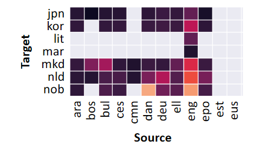

## Python implementation of: "Performance Prediction via Bayesian Matrix Factorisation for Multilingual Natural Language Processing Tasks"

This repository contains a Bayesian approach to performance prediction for multilingual NLP tasks.
The code is based on the implementations in [NLPerf](https://github.com/xiamengzhou/NLPerf) and [NLP-Bilingual-Task-Performance-Prediction](https://github.com/tianzhipengfei/NLP-Bilingual-Task-Performance-Prediction).  

Each src-folder contains the code for either MF, PMF, BPMF or BPMF CTX implementation.
In every scenario, the folder contains a main file to be run and parameters can be set via the utils-file.

To be comparable with [NLPerf](https://github.com/xiamengzhou/NLPerf), we use and compare both approaches using the same dataset splits given in folder "data/NLPerfSplit/". 
As the tests and comparisons can be performed for a maximum of 10 runs, 10 splits are available.
Complete files of performance scores and features can be found in the folder "data".

Here: Main idea of MF

 "Some title"

Liscense:
 This work is licensed under a <a rel="license" href="http://creativecommons.org/licenses/by-sa/4.0/">Creative Commons Attribution-ShareAlike 4.0 International License</a>.

